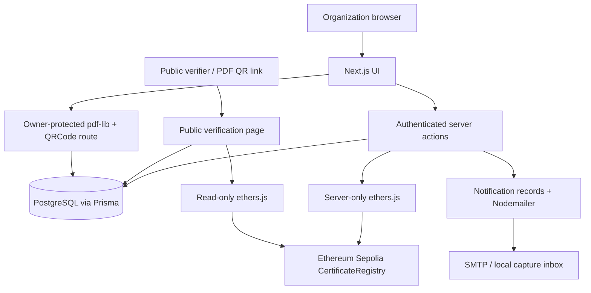
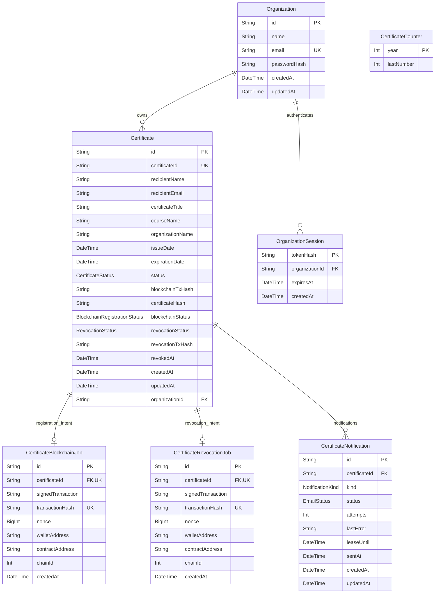

# Blockchain Certificate Verification System — Final Assignment Report

Prepared from the implemented project on **6 October 2026 (Asia/Bangkok)**. Replace the marked repository/video/contribution placeholders and insert your captured figures before exporting to the assignment PDF. Screenshot plans are in [submission-checklist.md](submission-checklist.md); final evidence and limitations are in [final-validation.md](final-validation.md).

## 1. System Overview

The Blockchain Certificate Verification System allows an authenticated organization to issue a digital certificate, register its cryptographic commitment on Ethereum Sepolia, download a professional PDF containing a QR link, notify the recipient, and permanently revoke the certificate when needed. Anyone can verify a readable certificate ID without an account.

PostgreSQL stores the detailed certificate and organization records. The registry stores a certificate ID, hash, issuer address, issue/expiration timestamps, and a revocation flag. Public verification recomputes the commitment from database fields and checks the registry, reporting VALID, EXPIRED, REVOKED, INVALID, or temporarily unavailable. Email addresses remain private, while recipient name and the permitted credential details are publicly displayed for a known ID.

The main actors are the issuing organization and public verifier. Demo University is a seeded development account, not proof of institutional accreditation. This is a university assignment on a test network, with manual transaction and notification recovery.

## 2. System Architecture

| Layer | Actual implementation and responsibility |
| --- | --- |
| Frontend | Next.js App Router pages in `src/app`, TypeScript React components, Tailwind styling; forms, navigation, status messages, and responsive layouts |
| Backend | Next.js server components, authenticated server actions, and a Node PDF route handler; validation, ownership checks, hashing, transaction recovery, and notification delivery |
| Database | PostgreSQL accessed through Prisma 7 and the PostgreSQL driver adapter; certificate records, organizations, hashed sessions, counters, durable transaction jobs, and notifications |
| Blockchain | Ethereum Sepolia (chain ID 11155111), accessed by server-only ethers.js using the configured RPC and signing wallet |
| Contract | Solidity `CertificateRegistry`, compiled/tested with Hardhat; immutable commitments, issuer authorization, verification flags, and permanent revocation |
| Document generation | Server-side pdf-lib with fontkit/local fonts; qrcode generates a PNG embedded in a landscape certificate |
| Email | Server-side Nodemailer SMTP; issuance/revocation notification records, retry leases, and a loopback-only capture inbox for development |



No private key or SMTP/database credential is sent to the browser. The organization session determines ownership; a browser-supplied organization ID is not trusted. Database and blockchain operations cannot be one atomic transaction, so signed intents are committed before broadcast and later reconciled.

## 3. User Flow / System Flow

### A. Organization login

Public home → Organization Login → Submit email/password → Server validates input and compares bcrypt hash → Invalid credentials show a generic error → Valid credentials create a random session token → Store only token SHA-256 in PostgreSQL → Set HttpOnly session cookie → Redirect to dashboard.

Protected page request → Hash session cookie → Lookup unexpired organization session → Load owning organization → Render private page. Missing/expired sessions → Redirect to login. Logout → Delete session record and cookie → Redirect to login; replayed old cookie cannot access protected routes.

### B. Issue certificate

Authenticated organization → Issue form → Server validates required fields/email/dates → Use session organization → Allocate annual readable ID atomically → Save PENDING record and deterministic hash → Reserve shared signing-wallet nonce → Sign registry call locally → Persist signed intent and transaction hash → Broadcast to Sepolia → Wait for successful confirmation and matching record → Update PostgreSQL registration to CONFIRMED and save transaction/hash → Queue issuance email → Attempt SMTP delivery independently → Redirect to certificate detail → Download PDF with QR link.

Before-broadcast failure → FAILED attempt without claiming blockchain issuance. Uncertain send/timeout → Preserve PENDING record → Owner checks/resumes the same signed transaction. Email failure → Preserve successful certificate → Show FAILED notification → Owner retries notification.

### C. Public verification

Enter readable certificate ID or scan PDF QR → Public `/verify/[certificateId]` → Normalize ID → Fetch allowed database fields without email → Recompute SHA-256 → Read existence, stored hash, timestamps, and revoked flag at a consistent chain block → Compare hashes and timestamps → Apply revocation/expiration rules → Display final result and public blockchain information.

Unknown ID/missing record/hash mismatch/inconsistent data → INVALID. Completed check with database/on-chain revocation → REVOKED. Authentic, unrevoked but expired → EXPIRED. Authentic and unexpired → VALID. Database/RPC check cannot complete → Verification temporarily unavailable; never assert valid.

### D. Revoke certificate

Authenticated owner → Confirmed certificate detail → Revoke Certificate → Confirm permanence → Re-check ownership and registration server-side → Read matching on-chain record → Sign revocation locally → Persist revocation job/nonce before broadcasting → Submit and confirm → Mark PostgreSQL REVOKED and record revocation transaction/time → Queue revocation email → Refresh detail/list/dashboard → Public verification and existing PDF QR show REVOKED.

Uncertain confirmation → Resume stored transaction. Mined revert → Preserve original certificate status and mark the attempt FAILED. On-chain success with failed database finalization → Recover the existing revoked record rather than create another revocation. An externally revoked matching record can also reconcile database status; transaction attribution may be unknown.

## 4. Database Design (ER Diagram)

The following models and fields match `prisma/schema.prisma`. `Certificate.certificateId` is the readable unique identifier; transaction-job `certificateId` fields instead reference the internal `Certificate.id`.



Key design details:

- One organization owns many certificates and sessions. Certificate ownership is required; deletion of an organization with certificates is restricted. Session rows cascade on organization deletion.
- Each certificate has at most one registration job and at most one revocation job, plus up to one notification per kind through a `(certificateId, kind)` unique constraint. Jobs/notifications cascade on certificate deletion.
- Each job table independently has `(chainId, walletAddress, nonce)` uniqueness. A shared advisory lock and nonce allocator serialize issuance/revocation reservations across both tables.
- `CertificateCounter` is independent, keyed by year; it has no foreign-key relationship. Increment and certificate insert are atomic. IDs resemble `CERT-2026-0001`, with at least four sequence digits.
- Issue and expiration dates use PostgreSQL date-only storage. Hashes, transaction hashes, `revokedAt`, notification error/lease/sent timestamps are nullable where declared in the schema. Signed intents are server-side records, not private keys, and are never exposed publicly.
- CertificateStatus: VALID/EXPIRED/REVOKED. BlockchainRegistrationStatus: UNREGISTERED/PENDING/CONFIRMED/FAILED. RevocationStatus: NONE/PENDING/CONFIRMED/FAILED. NotificationKind: ISSUED/REVOKED. EmailStatus: NOT_SENT/SENDING/SENT/FAILED. Public INVALID/unavailable results are computed, not persisted certificate enum values.

## 5. Blockchain Architecture

The registry is deployed on **Ethereum Sepolia**, chain ID **11155111**. Public deployed contract address checked during submission preparation: `0x3B980578276bbB81F85Fd7368655bD4ccE1b77ee`. [Open the public contract on Sepolia Etherscan](https://sepolia.etherscan.io/address/0x3B980578276bbB81F85Fd7368655bD4ccE1b77ee). Re-check the configured address if the project is redeployed.

Recipient name, email, title, course, and organization details are not sent to contract storage/events. Off-chain storage avoids immutable disclosure of those fields. The hash is a cryptographic commitment, not encryption; a party possessing the original data can recompute it. Recipient name and the specified credential details are intentionally disclosed by the public application, but recipient email remains private.

SHA-256 hashes UTF-8 bytes of a fixed-order JSON array:

```text
["certificate-v1", certificateId, recipientName, certificateTitle,
 courseName, organizationName, issueDate, expirationDate]
```

ID uses NFC normalization, trimming and uppercase, matching `CERT-YYYY-NNNN` with at least four sequence digits. Text uses NFC, collapsed Unicode whitespace, trimming, preserved case, and rejects empty/control-character data. Dates are valid `YYYY-MM-DD`; Prisma Date values use their UTC date component. Hash output is lowercase `0x` plus 64 hex digits. Email, status, transaction hash, and internal IDs are not committed. Full normalization is documented in [blockchain.md](blockchain.md).

A successful registry transaction creates the immutable ID/hash/issuer/timestamp entry and emits CertificateRegistered. A receipt plus its matching registry record proves that this commitment was registered by that wallet; it does not independently prove academic quality or real-world accreditation. The deploying owner/server wallet currently represents the platform issuer, not separate organization-controlled wallets.

Public verification compares the regenerated commitment with both the on-chain hash and saved database hash and checks timestamp consistency. Changed committed database fields produce a mismatch. Expiration is exclusive next-day Bangkok midnight after the printed expiration date; verification checks server time and the latest chain clock. Revocation changes the on-chain boolean permanently and overrides expiration after a completed check.

## 6. Smart Contract Design

`CertificateRegistry.sol` uses Solidity `^0.8.28`; Hardhat pins compilation to 0.8.28 with optimizer 200 runs and Cancun target. Certificate entries are held in a private mapping keyed by `keccak256(bytes(certificateId))`; this mapping key is separate from the SHA-256 credential commitment.

Stored certificate struct:

| Field | Solidity type | Meaning |
| --- | --- | --- |
| certificateId | string | Readable unique certificate identifier |
| certificateHash | bytes32 | SHA-256 commitment |
| issuer | address | Registering wallet |
| issuedAt | uint256 | Credential issue-date timestamp |
| expirationAt | uint256 | Exclusive expiration boundary |
| revoked | bool | Initially false; permanently set true by revocation |

| Function | Actual behavior |
| --- | --- |
| registerCertificate(id, hash, issuedAt, expirationAt) | Owner/authorized issuer only; validates nonempty ID ≤64 bytes, nonzero hash and issue time, expiration after issue; rejects duplicate ID; stores issuer and revoked=false |
| getCertificate(id) | Returns stored struct; missing ID reverts |
| verifyCertificate(id, expectedHash) | Returns exists, hashMatches, revoked, expired; missing ID returns four false flags; expiration compares block timestamp ≥ expirationAt |
| certificateExists(id) | Checks whether a nonzero issuer is stored |
| revokeCertificate(id) | Owner or original still-authorized issuer; missing/repeated revocation reverts; sets revoked=true |
| setIssuerAuthorization(address, bool) | Owner-only allowlist administration; zero address rejected |

The owner is immutable and initialized to the deploying wallet. The owner starts authorized. A different authorized issuer cannot revoke another issuer's certificate. On-chain wallet authorization and application organization ownership are distinct checks; both are enforced for application writes.

Events: `CertificateRegistered(string, bytes32, address indexed, uint256, uint256)`, `CertificateRevoked(string, address indexed)`, and `IssuerAuthorizationChanged(address indexed, bool)`. Custom errors: Unauthorized, InvalidCertificate, CertificateAlreadyExists, CertificateNotFound, CertificateAlreadyRevoked. There is no deletion/unrevocation function.

## 7. User Interface Design / Screenshots

The UI uses a restrained teal/slate palette, rounded panels, readable typography, responsive form grids, and an organization sidebar that becomes top navigation on smaller screens. Certificate tables scroll horizontally on narrow screens. Valid is teal/green, expired amber, revoked/invalid red, and unavailable neutral. Long hashes wrap. Buttons show pending states and errors, with confirmation for permanent revocation.

Insert actual screenshots with captions using the [screenshot checklist](submission-checklist.md#screenshot-checklist). Required figures:

1. Homepage and public/organization entry points.
2. Organization login form (password hidden).
3. Organization dashboard counts.
4. Certificate issue form using fictional recipient data.
5. Confirmed certificate detail with public transaction/hash.
6. Issued certificate list.
7. Landscape PDF with readable QR.
8. Public VALID verification showing matching hash/record.
9. Successful Sepolia transaction/explorer receipt.
10. Public REVOKED verification for the same demonstration certificate.
11. Recipient notification, with issuance and optionally revocation messages.

**[INSERT FIGURES 1–11 AND CAPTIONS HERE]**. Capture VALID before revoking the demonstration certificate. Do not put `.env`, wallet export screens, SMTP credentials, session cookies, or real recipient personal data in screenshots. A source-code sample preview on the homepage is illustrative and must not be claimed as a verified real certificate.

## 8. Implementation Summary

| Technology | Use in this project |
| --- | --- |
| Next.js | App Router server/client pages, server actions, owner-protected route handler |
| TypeScript | Typed forms, database access, blockchain utilities, and tests |
| Tailwind CSS | Responsive layout, consistent controls and status colors |
| PostgreSQL | Relational application data and durable job/notification tracking |
| Prisma | Schema, migrations, generated client, transactions, queries |
| Solidity | CertificateRegistry smart contract |
| Hardhat | Local simulated EVM, Solidity compilation, contract tests |
| ethers.js | RPC reads, local signing, broadcast/confirmation and contract interaction |
| Ethereum Sepolia | Public testnet deployment and credential commitments |
| pdf-lib | Server-side landscape PDF; fontkit/local fonts provide text support |
| QRCode (`qrcode`) | Absolute verification URL rendered as a QR image in PDF |
| Nodemailer | SMTP issuance/revocation notifications with independent retry status |

### Security

Passwords use bcryptjs with cost 12; the demo seed reads a private environment password instead of embedding it. Authenticated sessions use random 32-byte tokens, eight-hour expiry, and SHA-256 token hashes in PostgreSQL. Cookies are HttpOnly, SameSite=Lax, and Secure in production. Server actions and PDF routes re-check organization ownership. Login uses generic credential errors, unknown-account hash comparison, and an in-process login-attempt limiter.

Blockchain keys, RPC credentials, SMTP credentials, and database connection secrets remain server-only in ignored environment files. Public queries use an explicit field allowlist without recipient email. Contract storage holds the certificate hash rather than personal data. Public explorer links validate transaction hash format. SMTP logs/raw credential-bearing provider errors are suppressed. Signed intents and notification delivery details remain private. Git-eligible source and scoped history receive a credential scan before submission, with staged-file/media review still required.

### Testing and consistency

Automated checks exercise the actual app/SQL/local EVM/SMTP capture and include login/logout, exact dashboard counts, issuance persistence, PDF download and QR decoding, public verification statuses, tampering, owner isolation, revocation, email failures, and same-transaction recovery. Contract tests validate authorization, duplicates, events, hashes, and expiration. See [final-validation.md](final-validation.md) for final results and live-test limits.

Database and blockchain consistency uses durable pre-broadcast signed transaction jobs and later confirmation/reconciliation. Email queues commit with certificate finalization but delivery failures do not roll back certificate success. Unique notification rows plus leases prevent concurrent ordinary retries. SMTP acceptance followed by a database crash can still lead to duplicate email on retry.

### Limitations and future work

This assignment uses Sepolia test ETH and a shared platform wallet, with manual pending-job/email recovery. It has no automatic background reconciliation, fee replacement, multi-organization wallet enrollment, bounce monitoring, or hosted public demo deployment. Blockchain commitment does not validate real-world academic claims. Existing database-only records remain UNREGISTERED. Long-running confirmation and HTTPS secure-cookie requirements must be considered for deployment. Sensitive media and database dumps must be excluded from publication.

## 9. Public GitHub Repository Link

**[ADD THE REAL PUBLIC PROJECT REPOSITORY URL HERE]**

No project-specific Git repository/history or public URL was available during preparation: Git currently resolves to the parent Windows user directory and has no commits. Create/choose the proper repository rooted at this project, review staged files and history, run the secret check, and publish manually. Do not publish the parent user-directory repository. Do not fabricate a link or claim the repository is public before checking access while logged out.

## 10. Individual Contribution Report

Fill this table with the student's actual work and evidence. Names, student IDs, dates, contribution shares, and commit IDs were not provided and must not be invented.

| Student name / ID | Actual responsibility and contribution | Evidence (commits, files, tests, report/video work) | Contribution share, if required |
| --- | --- | --- | --- |
| [ADD NAME / STUDENT ID] | [DESCRIBE YOUR ACTUAL WORK] | [ADD VERIFIABLE EVIDENCE] | [ADD IF REQUIRED] |
| [ADD ANOTHER MEMBER ONLY IF APPLICABLE] | [DESCRIBE THEIR ACTUAL WORK] | [ADD VERIFIABLE EVIDENCE] | [ADD IF REQUIRED] |

For an individual submission, remove the extra row and describe the work actually completed. Preserve future project commits rather than rewriting history to manufacture a contribution timeline.

## 11. Public Demo Video Link

**[ADD THE REAL PUBLIC/INSTRUCTOR-ACCESSIBLE VIDEO URL HERE]**

Record the demonstration using the [demo video checklist](submission-checklist.md#demo-video-checklist): home → login → dashboard → issuance → Sepolia confirmation → PDF/QR → VALID verification → revocation → REVOKED verification → notification. Use fictional data, hide credentials, and test the final link while logged out. The video has not been uploaded automatically.
